# 🧠 GRUP148 – PROJEKA - AI Destekli Kariyer Yönlendirme Platformu

## 🎯 Proje Amacı

Üniversite öğrencilerini gerçek iş ilanlarına göre yönlendiren, sektörel verilerle desteklenmiş, AI tabanlı proje fikirleri ve README çıktıları sunan kişiselleştirilmiş bir kariyer destek platformu geliştirmek.

## 🌍 Hedef Kitle

- Yazılım veya veri alanında kariyer hedefleyen öğrenciler
- Yeni mezunlar
- Alan değiştirmek isteyen bireyler

## 🛠️ Kullanılan Teknolojiler

- Python 
- FastAPI (Backend)
- PostgreSQL (Veri tabanı)
- Gemini Pro API (LLM entegrasyonu)"
- HTML/CSS veya Streamlit (Frontend)
  

# 👥 Takım Üyeleri

| İsim             | Rolü                     | Sorumluluklar |
|------------------|--------------------------|----------------|
| Murat Ertuğrul   | Scrum Master             | Süreç yönetimi, günlük takibin yapılması, engel çözümü |
| Çağan Demir      | Product Owner / LLM      | Ürün vizyonu, prompt tasarımı, proje çıktıları |
| Damla Söylemez   | Veri ve LLM              | Veri temizliği, model çıktısı hazırlığı |
| Sevilay Mete     | Veritabanı & Backend     | PostgreSQL kurulumu, veri şeması |
| Dilara Yavuz     | Frontend                 | Arayüz tasarımı, çıktı sunumu |

---

# 🟩 Sprint 1 Raporu

## 🟩 Sprint 1 Notları
Bu sprintte proje için temel yapı oluşturuldu. Geliştirme ortamı hazırlandı, kullanıcı arayüzü taslakları belirlendi ve ilk işlevsel modül olan kullanıcı giriş sistemi geliştirildi. Sprint sonunda planlanan işlerin büyük çoğunluğu tamamlandı, eksik kalan görevler bir sonraki sprint'e aktarıldı.

## 🔎 Sprint Hedefleri

- Veri toplama ve anonimleştirme
- PostgreSQL kurulumu ve şema yapısı
- FastAPI temel uçlarının oluşturulması

## ✅ Gerçekleştirilen Görevler

- [x] FastAPI iskeleti oluşturuldu
- [x] `/register`, `/login`, `/get_jobs` uçları hazırlandı
      
## 🔢 Story Point Tahminleri

| Görev                                | SP  | Durum     |
|--------------------------------------|-----|-----------|
| PostgreSQL kurulumu                  | 3   | ❌ Tamamlanmadı |
| FastAPI kullanıcı kayıt/giriş uçları | 5   | ✅ Tamamlandı |
| FastAPI kullanıcı uçları             | 5   | ✅ Tamamlandı |
Toplam SP hedefi: **13**  
Tamamlanan: **10 SP** → Başarı oranı: **%76,92**

## 🧠 Tahmin Mantığı

Story point'ler; teknik karmaşıklık, zaman tahminine göre belirlendi. Story pointler Fibonacci dizisi ile değerlendirildi.

## ✅ Screenshots
Login ve Register ekranımızın ilk görüntüleri.
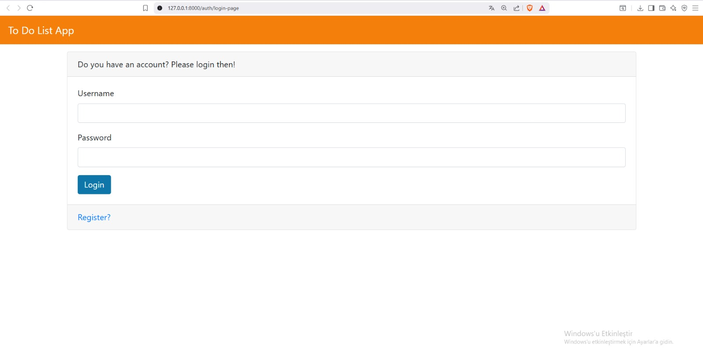
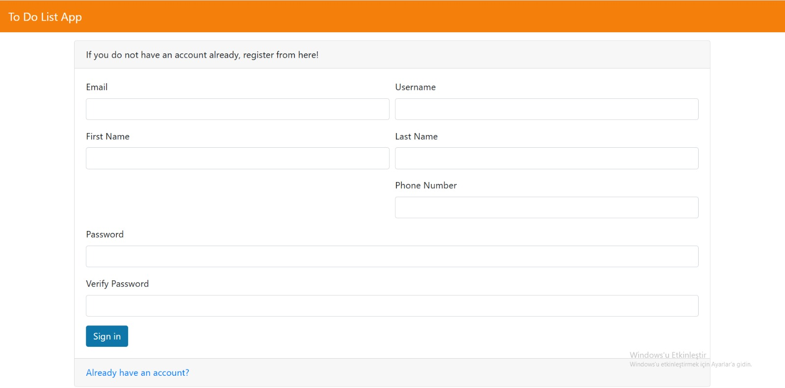

Canvadan yapılan arayüz planımız. 

https://www.canva.com/design/DAGrXwrKkiM/wuTyCV6tHednyuc-712lEA/view?utm_content=DAGrXwrKkiM&utm_campaign=designshare&utm_medium=link2&utm_source=uniquelinks&utlId=hfb2b8e41c4

## 🕓 Daily Scrum Özetleri

Takım olarak günlük toplantılarımızı genellikle Google Meet üzerinden gerçekleştirdik. Toplantılarda her ekip üyesi o gün üzerinde çalıştığı görevleri, yaşadığı engelleri ve bir sonraki adımını paylaştı. Toplantı dışında takım içi iletişim ağırlıklı olarak WhatsApp üzerinden sağlandı. Trello üzerinden ayrı bir daily panosu açıldı.
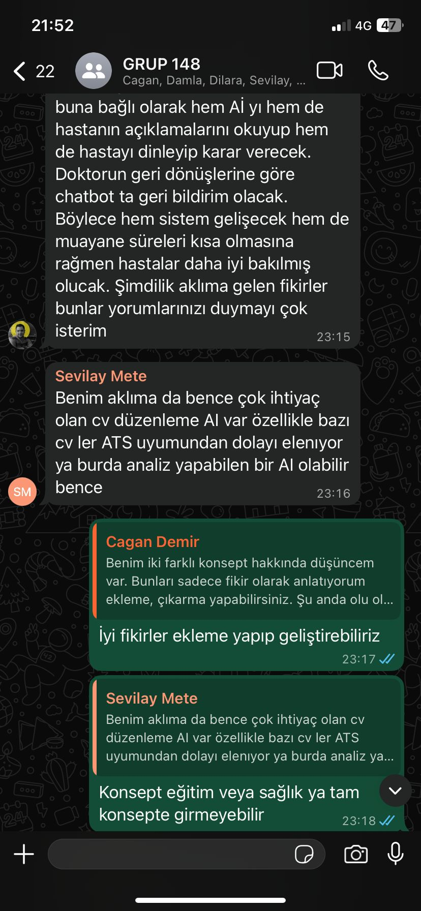

## 📋 Sprint Board
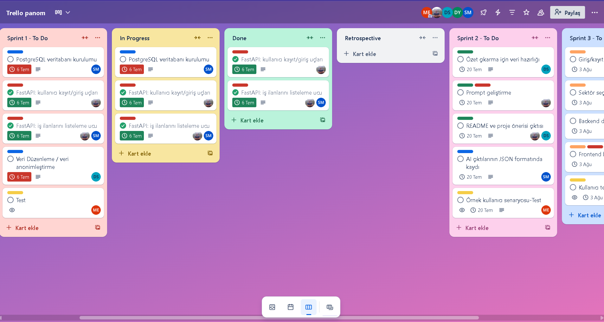
## 🔄 Sprint Review

Bu sprintin sonunda geliştirilen işlevler takım ve paydaşlarla birlikte gözden geçirildi. Kullanıcı giriş sistemi başarıyla tamamlandı ve test edildi. LLM üzerinde olumlu geri bildirimler alındı. Postgre bir sonraki sprint'e aktarılması kararlaştırıldı.  Anket sonuçları incelendi.
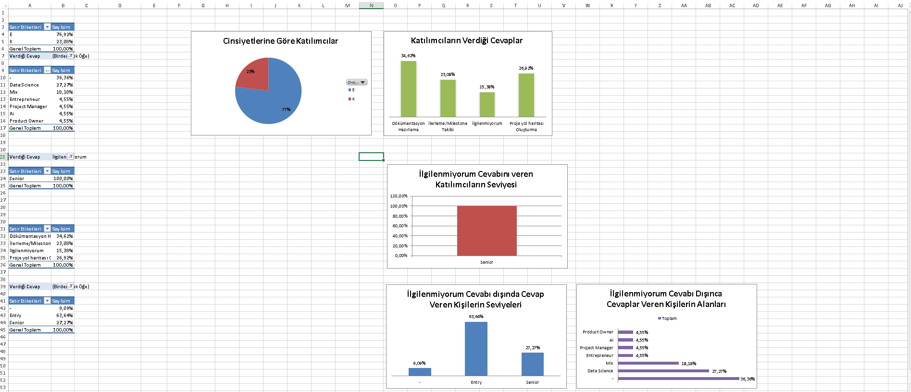
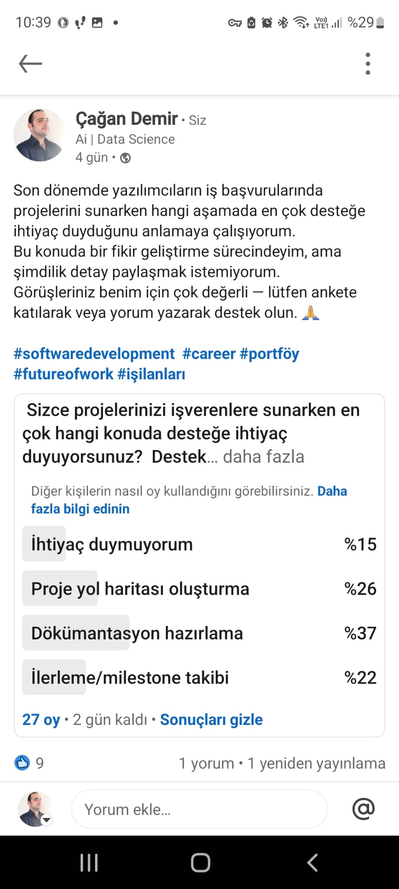

## 🔄 Sprint Retrospective

Sprint sonunda takım olarak süreçlerimizi değerlendirdik. Bu sprintte takım içi iletişim ve görev dağılımı kısmen başarılı şekilde yürütüldü. İletişim düzenli olarak devam etti ve önemli görevler zamanında tamamlandı. Takım olarak toplantıların daha etkili ve yoğun geçmesini kararlaştırdık. Görevlerde değişimlere gittik.

---

📝 Sprint 2’de LLM entegrasyonu ve proje çıktılarının kişiselleştirilmiş olarak sunulması hedeflenmektedir.

---

# 🟩 Sprint 2 Raporu

## 🟩 Sprint 2 Notları
Bu sprintte, proje kapsamında yapay zekâ destekli özet çıkarma modülünün veri hazırlık aşamaları tamamlandı. İlk olarak, özet çıkarma işlemleri için uygun veri parçaları hazırlanarak temizlendi. Ardından, kişisel veri içeren bölümler anonimleştirilerek sistem güvenliği sağlandı.

Veri işleme süreci tamamlandıktan sonra, yapay zekâdan alınan çıktıların JSON formatına uygun şekilde saklanması sağlandı. Böylece, backend sisteminde bu verilerin işlenebilir ve frontend'e aktarılabilir bir formata dönüştürülmesi hedeflendi.

## 🔎 Sprint Hedefleri

Özet çıkarma süreci için veri ön hazırlığı yapılması, AI çıktı formatlarının düzenlenmesi ve sistemde kullanılabilir JSON yapısına dönüştürülmesi.

## ✅ Gerçekleştirilen Görevler

- [x] Özet çıkarma için veri hazırlığı
- [x] Veri Düzenleme / veri anonimleştirme
- [x] AI çıktılarının JSON formatında kaydı
- [x] Mevcut tablolar haricinde,Kullanıcı ilerlemesi, promptlar, kullanıcı konuşmaları için tablolar
      
## 🔢 Story Point Tahminleri

| Görev                                | SP  | Durum     |
|--------------------------------------|-----|-----------|
| Özet çıkarma için veri hazırlığı     | 3   | ✅ Tamamlandı |
| Veri Düzenleme / veri anonimleştirme | 2   | ✅ Tamamlandı |
| AI çıktılarının JSON formatında kaydı| 2   | ✅ Tamamlandı |
| Mevcut tablolar harici tablolar      | 2   | ✅ Tamamlandı |
Toplam SP hedefi: **9**  
Tamamlanan: **9 SP** → Başarı oranı: **%100**

## 🧠 Tahmin Mantığı

Story point'ler; teknik karmaşıklık, zaman tahminine göre belirlendi. Story pointler Fibonacci dizisi ile değerlendirildi.

## ✅ Screenshots
Projekadan görüntü ve veri düzenimiz.
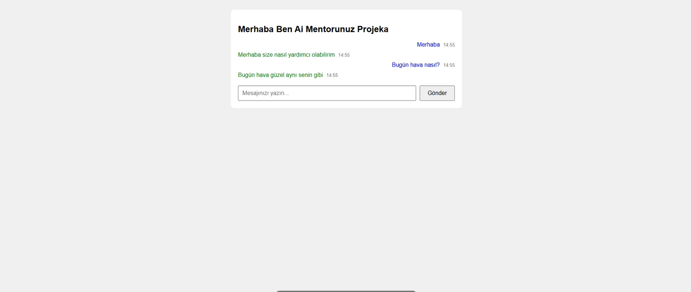
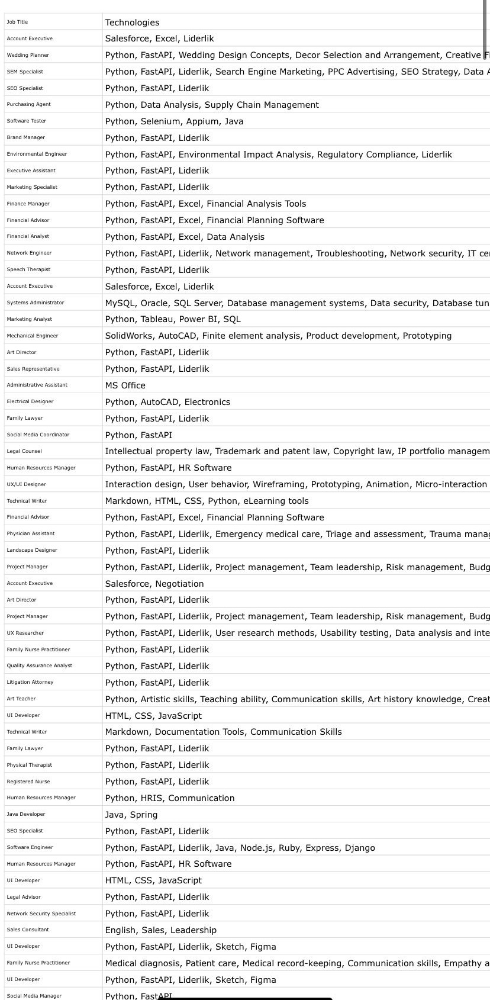

## 🕓 Daily Scrum Özetleri

Takım olarak günlük toplantılarımızı genellikle Google Meet üzerinden gerçekleştirdik. Toplantılarda her ekip üyesi o gün üzerinde çalıştığı görevleri, yaşadığı engelleri ve bir sonraki adımını paylaştı. Toplantı dışında takım içi iletişim ağırlıklı olarak WhatsApp üzerinden sağlandı. Trello üzerinden ayrı bir daily panosu açıldı.
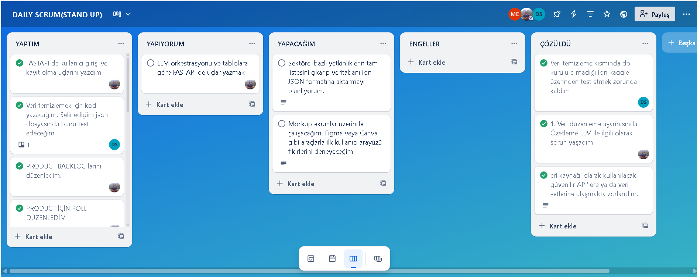

## 📋 Sprint Board
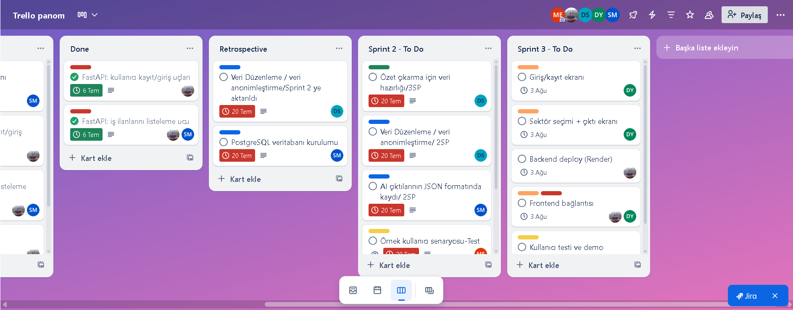
## 🔄 Sprint Review

Bu sprintte, yapay zekâ destekli özet çıkarma modülünün veri hazırlık ve kayıt süreci odak noktasıydı. Aşağıdaki görevler başarıyla tamamlandı. Sprintin sonunda geliştirilen modüller takım ve proje asistanı ile birlikte gözden geçirildi. Backend tarafında sistem mimarisi oturmaya başladı.

## 🔄 Sprint Retrospective

Sprint sonunda takım olarak süreçlerimizi değerlendirdik. Bu sprintte takım içi iletişim ve görev dağılımı başarılı şekilde yürütüldü. İletişim düzenli olarak devam etti ve önemli görevler zamanında tamamlandı. Takım olarak son sprintte toplantı ve teslim tarihlerine daha sıkı süreler vermeyi kararlaştırdık. 

# 🟩 Sprint 3 Raporu

## 🟩 Sprint 3 Notları
Bu sprintte temel amaç; frontend ve backend bileşenlerinin birleştirilmesi, sektör seçimi akışının oluşturulması ve yapay zekâ (LLM) modülünün sisteme entegre edilerek temel çıktıların alınmasıydı. Sprint 3'te yalnızca Giriş/Kayıt ekranı tamamlanabilmiş olup, diğer görevlerde ilerleme kaydedilememiştir. Zaman yönetimi, görev paylaşımı veya teknik engeller gibi faktörlerin değerlendirilmesi gerekmektedir.

## 🔎 Sprint Hedefleri

Sprint 3'te temel kullanıcı arayüzü ile birlikte kayıt sistemi entegrasyonu ve sistemin uçtan uca minimum çalışır halinin ortaya çıkarılması hedeflenmiştir. Ayrıca LLM entegrasyonu yapılması planlanmıştır.

## ✅ Gerçekleştirilen Görevler

- [x] Giriş/kayıt ekranı
      
## 🔢 Story Point Tahminleri

| Görev                                | SP  | Durum     |
|--------------------------------------|-----|-----------|
| Giriş/kayıt ekranı                   | 3   | ✅ Tamamlandı |
| Backend                              | 4   | ❌ Tamamlanmadı |
| Sektör seçimi + çıktı ekranı         | 4   | ❌ Tamamlanmadı |
| Frontend bağlantısı                  | 2   | ❌ Tamamlanmadı |
| LLM                                  | 5   | ❌ Tamamlanmadı |

Toplam SP hedefi: **18**  
Tamamlanan: **3 SP** → Başarı oranı: **%16,66**

## 🧠 Tahmin Mantığı

Story point'ler; teknik karmaşıklık, zaman tahminine göre belirlendi. Story pointler Fibonacci dizisi ile değerlendirildi.

## ✅ Screenshots
Projekadan görüntü ve veri düzenimiz.

## 🕓 Daily Scrum Özetleri

Takım olarak konuşmalarımızı genellikle Whatsapp üzerinden gerçekleştirdik. Toplantılarda her ekip üyesi o gün üzerinde çalıştığı görevleri, yaşadığı engelleri ve bir sonraki adımını paylaştı. Trello üzerinden ayrı bir daily panosu kullanıldı.
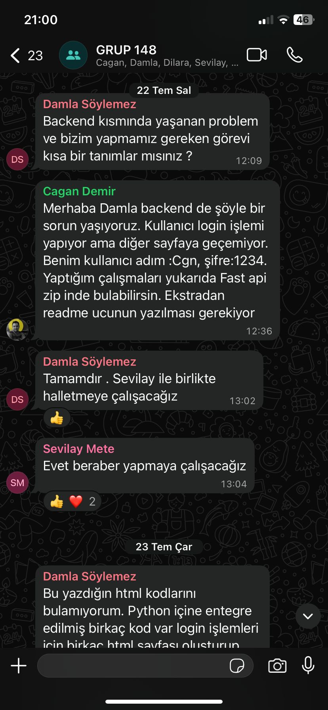

## 📋 Sprint Board
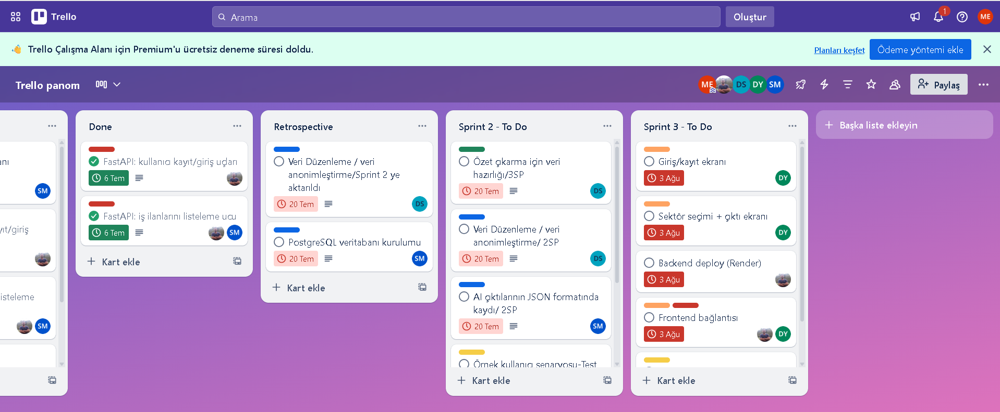
## 🔄 Sprint Review

Bu sprintte, projenin temel bileşenlerini birleştirerek çalışır bir sistem elde etmek hedeflendi. Ancak süre sonunda planlanan görevlerin büyük bölümü tamamlanamadı. Giriş/kayıt ekranı dışında, backend, frontend bağlantısı ve LLM entegrasyonu gibi kritik adımlar eksik kaldı. Sprint sonunda mevcut ilerleme ekip ile birlikte değerlendirilerek eksik noktalar tespit edildi. Proje süresi dolduğu için hedeflenen ürün ortaya konamadı, ancak teknik altyapı ve planlama konusunda önemli deneyimler edinildi.

## 🔄 Sprint Retrospective

Bu sprintte projenin son adımlarını tamamlamayı hedefledik. Bazı teknik engeller ve zaman sınırlamaları nedeniyle planladığımız tüm işleri tamamlayamasak da, bu süreç boyunca birlikte değerli deneyimler kazandık.
Özellikle görevler arasındaki bağımlılıkları ve altyapı hazırlığının önemini bu sprintte daha net şekilde gözlemledik. Her bir ekip üyesinin katkısı ve çabası, projenin şekillenmesinde büyük rol oynadı.
Proje süresinin sonuna gelmiş olsak da, birlikte çalışırken edindiğimiz tecrübeler, takım içi dayanışmamız ve öğrendiğimiz dersler bir sonraki projelerimizde bize yol gösterecek.

Emeği geçen herkese teşekkürler! 🙌 
